LBG-algorithm-opencv
====================

Terminal Out:
-------------
* Initial d0 = 996229787
* After 19 iterations, d0 = 1296780143, d1 = 1296435116.
* Time elapsed: 6090000 cycles.

<pre>
For a larger L(codebook size), the quality of the quantized image will improve of course, 
but the calculation will also take more time.
</pre>

The original image:
----------------
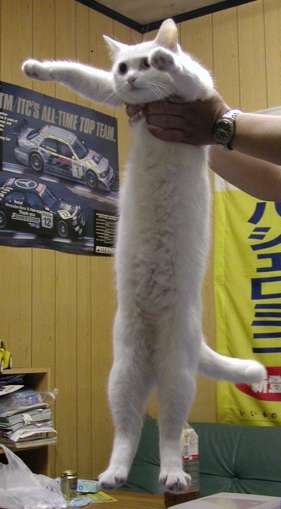 

Image Out:
-------------

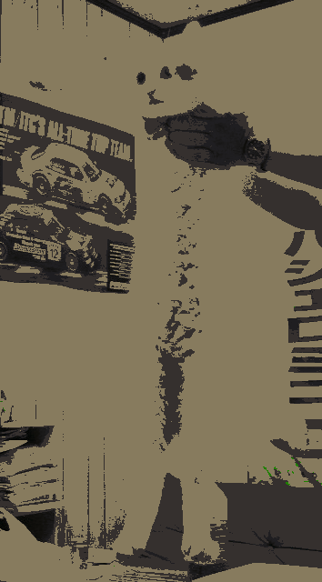
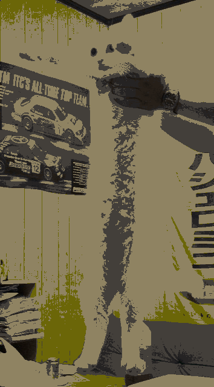
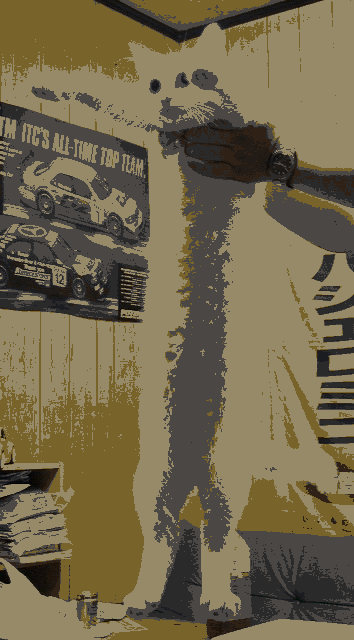
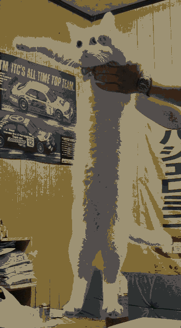
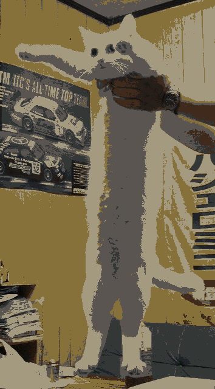
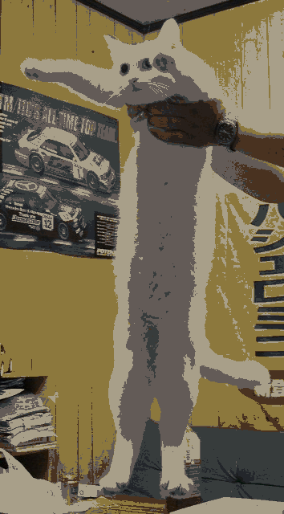
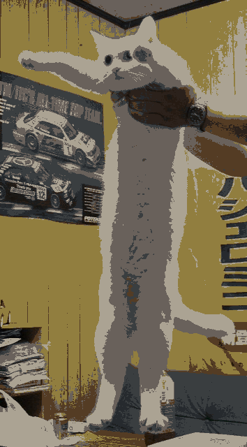
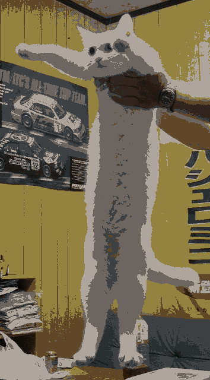
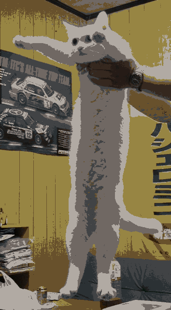
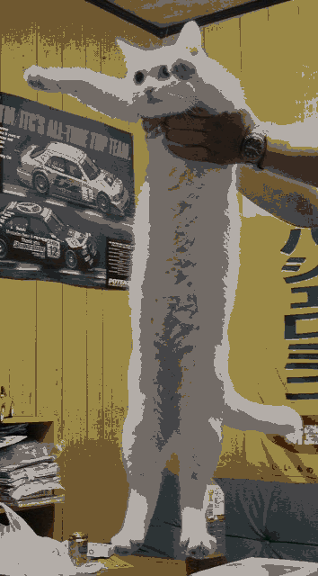
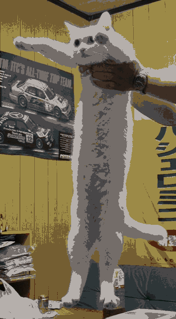

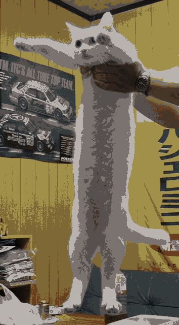

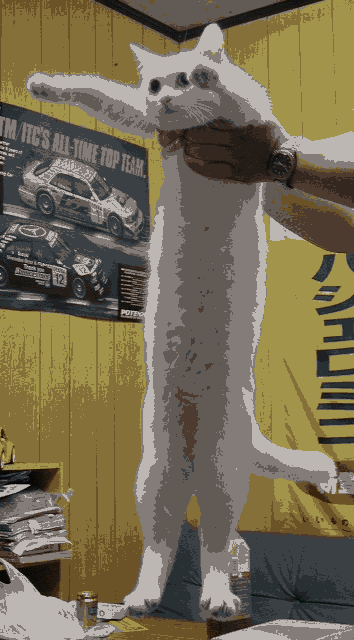
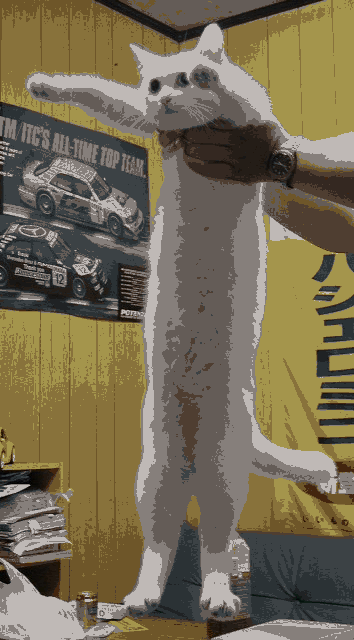

The program is not that generalized(for different dimension numbers etc).
