LBG-algorithm-opencv
====================

Terminal Out:
Initial d0 = 996229787
After 19 iterations, d0 = 1296780143, d1 = 1296435116.
Time elapsed: 6090000 cycles.

For a larger L(codebook size), the quality of the quantized image will improve of course, but the calculation will also take more time.

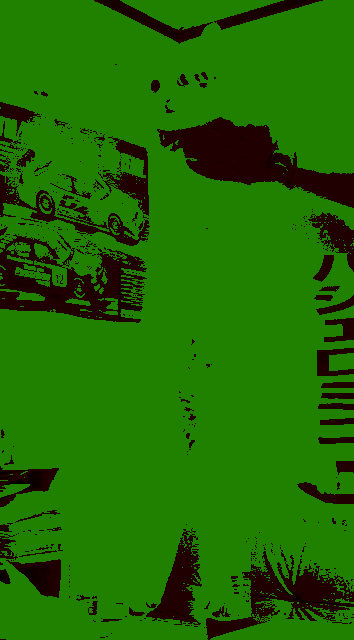
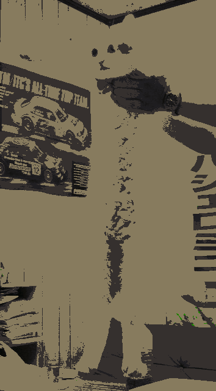
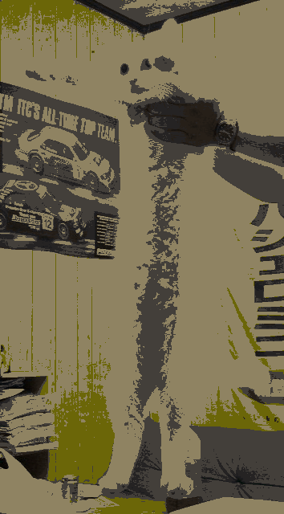
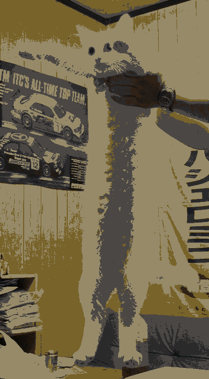
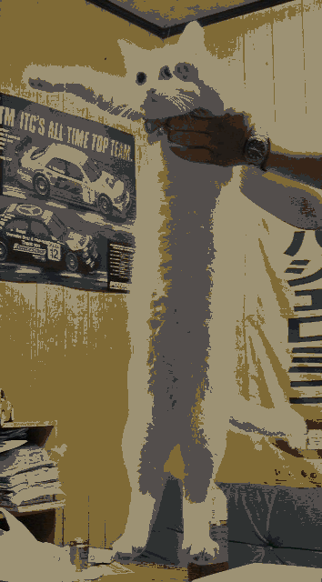
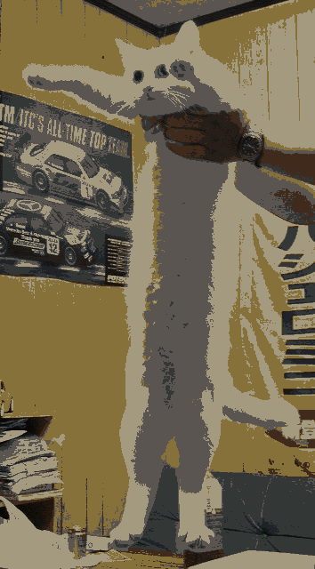
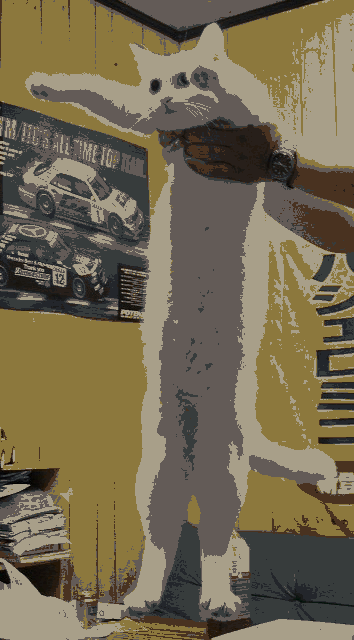
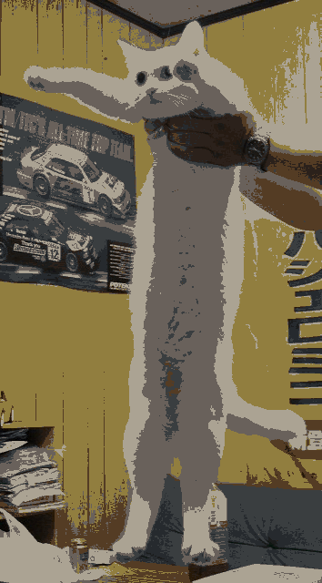
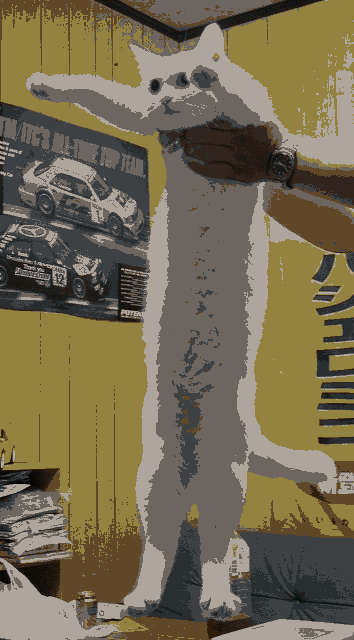
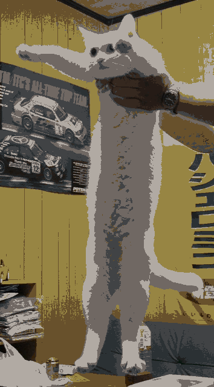
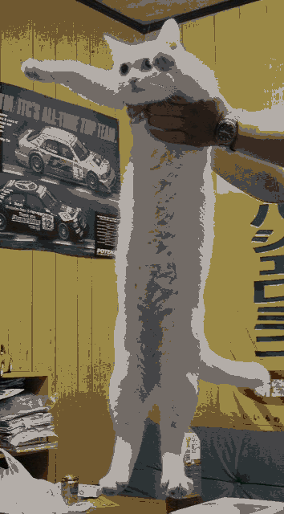
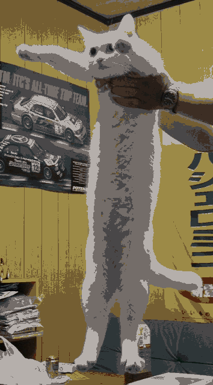

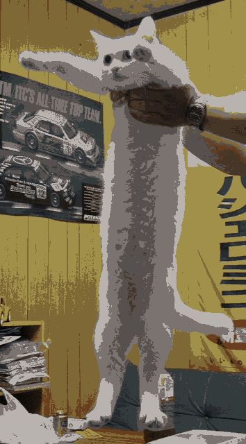

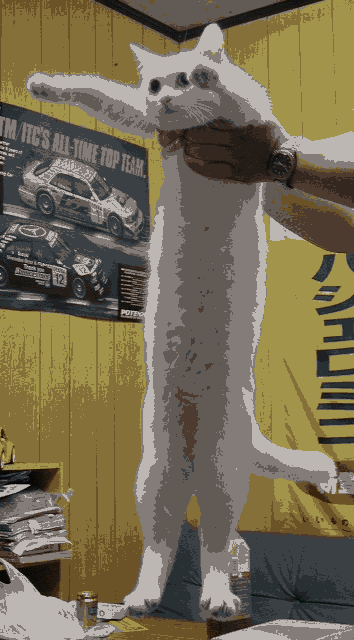
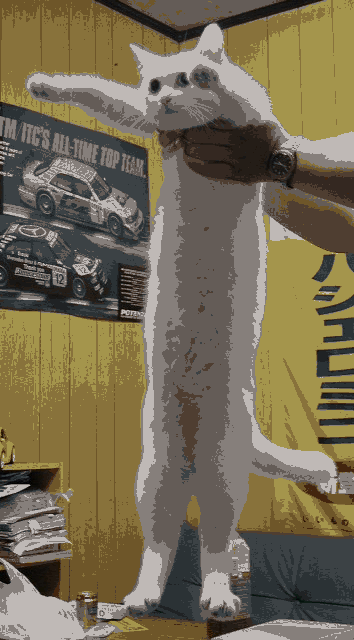

